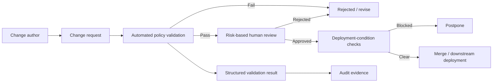

# Architecture

## Purpose

Infrastructure Change Quality Gate (Gatehouse) is a lightweight policy-validation and evidence-generation layer for infrastructure change workflows.

It is designed to answer a small set of operational questions before a change is merged or deployed:

- Is the change described well enough to review?
- Has risk been classified explicitly?
- Are testing and rollback requirements present for the risk level?
- Are the required approvals represented?
- Are deployment constraints, such as freeze windows, satisfied?
- Can the validation result be retained as audit evidence?

Gatehouse is intentionally not a deployment platform, CMDB, ticketing system or identity provider. It is a validation boundary that can sit in front of those systems.

## High-level flow



The repository provides both a legacy validator entry point and a modular CLI implementation. CI/CD workflows invoke the same validation logic used locally so that the policy behaviour is reproducible outside GitHub Actions.

## Main components

### Change-request input

Change requests are Markdown documents based on repository templates. They carry the human-readable evidence required by the policy engine, such as scope, risk classification, approvers, test plan and rollback plan.

### Validation layer

The validation code under `validation/` parses and evaluates change-request content against policy requirements. The validator is intentionally generic: integration examples such as RBAC-Lite are inputs to the policy model, not hard-coded product logic.

The validation result can be emitted in machine-readable form for CI/CD use.

### Policy configuration

`gatehouse.yaml` and supporting schema/configuration files define repository-level policy expectations. Policy is kept separate from example change content so that the validation model can evolve without coupling it to one integration.

### CI/CD gates

Workflows under `.github/workflows/` provide continuous validation and evidence generation. Their responsibilities include:

- running policy validation;
- exercising known-good example inputs;
- running code/security quality checks;
- writing validation results to the workflow summary; and
- publishing generated evidence as workflow artifacts where configured.

CI is an enforcement and evidence layer, not the source of truth for business approval. Human approval remains an explicit gate for changes that require it.

### Evidence generation

Scripts under `scripts/` can generate local Markdown evidence from validation runs. Generated reports belong under `reports/` and are intentionally ignored by Git because they are run outputs, not source code.

The `evidence/` directory is reserved for curated, non-sensitive demonstration evidence that is intentionally committed to the portfolio repository.

## Risk model

Gatehouse uses three demonstration risk classes:

| Class | Intent | Typical control level |
|---|---|---|
| 1 | Low-risk or documentation-oriented change | basic validation + review |
| 2 | Material configuration / infrastructure / access change | stronger review + test and rollback evidence |
| 3 | Critical or high-blast-radius change | enhanced approval + deployment constraints + explicit recovery evidence |

The risk classes are a reference implementation, not a universal organizational standard. A production adopter should map them to its own change policy, roles and risk appetite.

## Trust boundaries

Gatehouse assumes that different controls provide different kinds of assurance:

1. **Author-provided content is untrusted input.** The validator checks structure and required evidence; it cannot prove that a written statement is true.
2. **Automated validation proves policy conformance, not business correctness.** Passing CI means required checks passed, not that the infrastructure change is inherently safe.
3. **Human approval is a separate trust boundary.** Reviewers are responsible for technical and organizational judgement that automation cannot replace.
4. **Deployment systems remain downstream.** Gatehouse does not require credentials to production infrastructure and should not become a privileged deployment broker unless explicitly redesigned for that role.
5. **Audit evidence must not contain secrets.** Validation outputs and committed examples must use synthetic or non-sensitive data.

## Failure behaviour

The preferred failure mode is fail-closed for missing mandatory evidence: a change that lacks required fields should not pass the automated gate.

Operationally, Gatehouse should remain easy to bypass only through an explicit, reviewable policy decision. Silent bypasses undermine the purpose of the control.

If CI is unavailable, the validator can be run locally. A production organization should define its own emergency-change process rather than treating CI failure as automatic permission to merge.

## Security design principles

- no production credentials are required for normal validation;
- examples must contain synthetic data only;
- generated evidence should be minimized to what is needed for review;
- dependencies and workflow actions should be reviewed and pinned where practical;
- policy changes should receive the same or stronger review as the changes they govern;
- validation logic should be deterministic and runnable locally;
- rollback and recovery evidence are first-class change requirements.

## Compliance positioning

This repository is a **portfolio/reference implementation of ISO 27001-aligned change-control thinking**. It is not a certification, conformity assessment or claim that adopting the repository by itself makes an organization ISO 27001 compliant.

Control mappings in documentation are design references. A real implementation must be mapped to the organization's applicable ISO 27001 edition, statement of applicability, policies, roles, evidence-retention requirements and risk-management process.

## Non-goals

Gatehouse does not attempt to provide:

- a complete ITSM platform;
- production deployment orchestration;
- privileged-access management;
- a CMDB or authoritative asset inventory;
- identity proofing for approvers;
- a complete GRC platform;
- automatic certification or compliance status.

Those systems can integrate with the quality gate, but they remain separate responsibilities.

## Extension model

A practical extension should keep the same separation of concerns:

```text
change input
   -> schema / parser
   -> policy evaluation
   -> machine-readable result
   -> human review
   -> evidence output
   -> downstream system
```

New integrations should prefer adapters, schemas or policy configuration over product-specific logic in the core validator.

## Architectural decision summary

The project deliberately chooses a small, inspectable architecture over a heavy governance platform. Markdown, Python, YAML and GitHub Actions are sufficient for demonstrating the control loop while keeping the entire implementation reviewable, portable and recoverable.

That trade-off is intentional: the goal is to demonstrate controlled change and evidence generation without making the governance mechanism more complex than the changes it governs.
