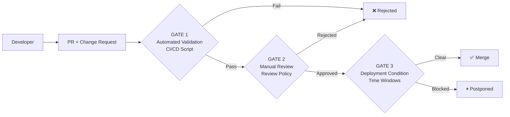

<div align="center">

# 🏛️ Infrastructure Change Quality Gate

**Policy validation engine & approval gates for infrastructure changes**

[](https://www.iso.org/standard/27001)
[](#)
[](LICENSE)
[](validation/)


[](https://github.com/Jonnenpijonne/infrastructure-change-quality-gate/actions/workflows/compliance-check.yml)
[](https://github.com/Jonnenpijonne/infrastructure-change-quality-gate/actions/workflows/quality-gate.yml)

</div>

---

## 🎯 High-Level Overview

**Infrastructure Change Quality Gate** is a DevSecOps compliance and governance automation tool for enforcing formal change management processes around infrastructure changes. It provides a lightweight policy validation engine, risk-based approval gates, CI/CD validation, and audit evidence generation for infrastructure change requests.

The project is designed as a portfolio-grade implementation of ISO 27001-aligned change management controls, with practical examples for infrastructure, access management and RBAC/IAM governance use cases.

It demonstrates:

- automated validation of Markdown-based change requests
- risk classification and approval requirements
- rollback, test plan and freeze-window checks
- GitHub Actions quality gates
- local Markdown audit evidence reporting
- integration-oriented governance examples such as RBAC-Lite

---

## 📋 Purpose

This repository implements a **formal change management process for critical infrastructure**. The system is based on ISO 27001 change management controls and provides an automated quality gate that validates change requests before merge.

The validator is a **modular, generic policy engine** that can be used as a standalone tool or integrated with governance frameworks like RBAC-Lite.

---

## 🏗️ Architecture





### Three Quality Gates

| Gate | Name | Description |
|------|------|-------------|
| **1** | **Automated validation (CI/CD)** | Python script checks change request structure, risk level, rollback plan, and freeze windows |
| **2** | **Manual review** | Number of reviewers based on risk level (1-3 persons) |
| **3** | **Deployment condition** | Time window check, staging validation, communication plan for critical changes |

---

## ⚠️ Risk Classes

| Class | Level | Approvers | Examples |
|:-----:|-------|-----------|----------|
| **1** | Low | 1 | Documentation, minor configurations |
| **2** | Medium | 2 | Infrastructure config, CI/CD changes, access management |
| **3** | Critical | 3 + CISO | Network architecture, database migrations, security |

---

## 🔒 ISO 27001 Mapping

| Control | Description |
|---------|-------------|
| **A.12.1.2** | **Change Management** — Changes are documented, classified, and approved |
| **A.14.2.2** | **System Change Control** — Formal, auditable change process |
| **A.12.4.1** | **Event Logging** — Automated audit trail via CI/CD |

---


## 📁 Repository Structure


---
```
. 
├── .github/workflows/                  # CI/CD quality gate and audit evidence workflows
├── docs/                               # Documentation and governance
│   ├── integrations/
│   │   └── rbac-lite.md               # RBAC-Lite integration example
│   ├── risk-matrix.md
│   └── change-classification.md
├── templates/                          # Change request templates
│   ├── change-request-template.md
│   └── rollback-plan-template.md
├── validation/                         # Automated validation engines
│   ├── pre-merge-checks/
│   │   └── validate-change-request.py # Legacy validator (entry point)
│   └── pre_merge_checks/
│       └── cli.py                      # Modular CLI validator
├── scripts/                            # Audit and reporting tools
│   └── generate-audit-report.sh       # Local audit evidence report generator
├── examples/                           # Pre-filled examples
│   └── rbac-lite-partner-access-change.md
└── reports/                            # Generated audit evidence (ignored by Git)
```

---


---

## 🚀 Getting Started

1. **Copy** `templates/change-request-template.md` to PR description
2. **Fill** in all required fields
3. **CI/CD** runs automated validation
4. **Request review** according to risk level
5. **Merge** only after passing all gates

---
## 🧪 Quick Demo — Run the Quality Gate Locally

Test the policy engine in under 2 minutes on your local machine.

### Prerequisites
- Python 3.8+
- Git
- Bash or Git Bash (Windows)

### Run it

**1. Clone and enter the repo**
```bash
git clone https://github.com/Jonnenpijonne/infrastructure-change-quality-gate.git
cd infrastructure-change-quality-gate
```

**2. Test a valid Class 2 change request (should PASS)**
```bash
python validation/pre-merge-checks/validate-change-request.py \
  examples/rbac-lite-partner-access-change.md
```

**3. Test with the modular CLI validator**
```bash
python validation/pre_merge_checks/cli.py \
  examples/rbac-lite-partner-access-change.md
```

**4. Run unit tests**
```bash
python -m pytest -q
```

Expected output: `QUALITY GATE: PASSED`

**5. Generate local audit evidence report**
```bash
scripts/generate-audit-report.sh examples/rbac-lite-partner-access-change.md
```

Expected output location: `reports/gatehouse-audit-evidence-report.md`

### What the validator checks
- ✅ Required sections present
- ✅ All mandatory fields filled
- ✅ Risk class defined and justified (1-3)
- ✅ Rollback plan present (Class 2-3)
- ✅ Sufficient approvers named (1-3 based on risk)
- ✅ Test plan present (Class 2-3)
- ✅ Freeze period checked (Class 3)
- ✅ JSON output for CI/CD integration

---

## 🔗 RBAC-Lite Integration Example

RBAC-Lite is a WordPress-based multi-tenant access control framework focused on partner-based data isolation and compliance audit logging. This validator can be integrated with RBAC-Lite as a **governance and approval gate** for infrastructure and access management changes.

### Key Points

- **The validator is generic** and policy-agnostic. RBAC-Lite is one example integration, not hardcoded logic.
- **Risk classification boundary:**
  - **Risk Class 2** = validator repository (this project) governance/integration example
  - **Risk Class 3** = real production RBAC-Lite tenant isolation / partner isolation code changes
- The validator does not replace RBAC-Lite; it validates whether RBAC-Lite-related changes meet governance and approval requirements before merge.

### Integration Resources

- Documentation: [`docs/integrations/rbac-lite.md`](docs/integrations/rbac-lite.md)
- Example change request: [`examples/rbac-lite-partner-access-change.md`](examples/rbac-lite-partner-access-change.md)
- Related repository: [RBAC-Lite](https://github.com/Jonnenpijonne/RBAC-Lite)

### Example Validation Command

```bash
python validation/pre-merge-checks/validate-change-request.py \
  examples/rbac-lite-partner-access-change.md
```

---

## 📊 Audit Evidence Reports

This repository generates local Markdown audit evidence reports to document change validation and approval trails. Reports are suitable for compliance evidence and governance audits.

### Generate Local Report

```bash
scripts/generate-audit-report.sh examples/rbac-lite-partner-access-change.md
```

**Output:**
```
reports/gatehouse-audit-evidence-report.md
```

The report includes:
- Validator JSON output (structured validation results)
- Risk classification details
- Approval chain and reviewer evidence
- Test plan and rollback plan summary
- Audit trail metadata

### Reports Directory

The `reports/` directory is ignored by Git because audit evidence reports are **generated artifacts**, not source code. Each time you run validation, a new audit evidence report is created with:
- Validation timestamp
- Pass/fail status with detailed findings
- Governance compliance checkpoints

---

## 🤖 GitHub Actions

This repository includes automated CI/CD workflows for continuous quality gate enforcement and audit evidence generation.

### Workflows

| Workflow | Path | Purpose |
|----------|------|---------|
| **Quality Gate** | `.github/workflows/quality-gate.yml` | Runs automated validator on all PR change requests |
| **Quality Gate Demo** | `.github/workflows/quality-gate-demo.yml` | Demonstrates validator with example inputs |
| **Audit Evidence Report** | `.github/workflows/audit-evidence-report.yml` | Generates and publishes audit evidence as workflow summary |
| **Compliance Check** | `.github/workflows/compliance-check.yml` | Verifies ISO 27001 compliance gates |
| **CodeQL / Python Quality** | `.github/workflows/codeql-python.yml` | Security scanning and code quality analysis |

### Audit Evidence Workflow

The audit evidence workflow:
1. Runs the validator on change requests
2. Generates a Markdown audit evidence report
3. **Writes the report to GitHub Actions Summary** (visible in workflow run details)
4. **Uploads `reports/` as an artifact** with 90-day retention for audit evidence archival

This ensures every change is documented with auditable proof of validation and approval.

---

## 🌿 Branch Strategy

| Branch | Purpose |
|---|---|
| `main` | Default branch and current source of truth. Contains the validated portfolio-ready baseline. |
| `develop` | Legacy/development branch, retained only if active development requires it. |
| `demo/johtoportaalle` | Legacy leadership/demo branch. May be updated or removed if no longer needed. |
| `test/compliance-kit-demo` | Legacy compliance kit test/demo branch. May be updated or removed if no longer needed. |

> Current development should normally start from `main` unless a specific demo or test branch is intentionally maintained.

---

## 📜 License

MIT License. See [LICENSE](LICENSE) file for details.

---

<div align="center">

## 🔗 Infrastructure Change Quality Gate

**A DevSecOps governance and quality gate engine** for infrastructure changes, designed as a **portfolio artifact** demonstrating:

- 🏛️ Formal change management & compliance automation
- 🔐 ISO 27001 aligned governance controls
- 📋 Audit evidence and compliance documentation
- 🔗 Integration with governance frameworks (RBAC-Lite example)
- 🚀 CI/CD-native policy enforcement
- 🛡️ Role-based approval workflows
- 📊 Automated audit trail generation

**Suitable for DevSecOps, governance, operational security, IAM/RBAC, audit evidence, and compliance automation roles.**

</div>
