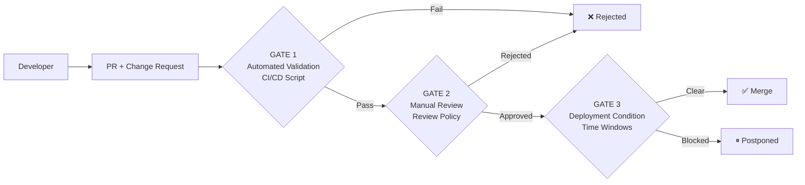

<div align="center">

# 🏛️ Infrastructure Change Quality Gate

**Policy validation engine & approval gates for infrastructure changes**

[](https://www.iso.org/standard/27001)
[](#)
[](LICENSE)
[](validation/)

[](https://github.com/Jonnenpijonne/infrastructure-change-quality-gate/actions/workflows/compliance-check.yml)
[](https://github.com/Jonnenpijonne/infrastructure-change-quality-gate/actions/workflows/quality-gate.yml)

</div>

---

## 🎯 High-Level Overview

**Infrastructure Change Quality Gate** is a lightweight DevSecOps governance and policy-validation tool for infrastructure change workflows. It provides risk-based validation, approval requirements, CI/CD gates and generated audit evidence around change requests.

The project is a **portfolio/reference implementation of ISO/IEC 27001-aligned change-control thinking**. It demonstrates how change requirements can be represented, checked and retained as evidence without claiming that the repository itself provides certification or organizational compliance.

It demonstrates:

- automated validation of Markdown-based change requests
- risk classification and approval requirements
- rollback, test plan and freeze-window checks
- GitHub Actions quality gates
- generated Markdown audit evidence
- integration-oriented governance examples such as RBAC-Lite

See also:

- [Architecture and trust boundaries](ARCHITECTURE.md)
- [Security policy](SECURITY.md)
- [Change classification](docs/change-classification.md)
- [Risk matrix](docs/risk-matrix.md)

---

## 📋 Purpose

This repository implements a **reference model for formal infrastructure change management**. The validator checks whether a change request contains the evidence required by the configured policy before merge.

The validator is a **modular, generic policy engine** that can be used as a standalone tool or integrated with governance examples such as RBAC-Lite.

Automated validation proves that configured policy checks passed. It does **not** prove that an author-provided statement is true, that a human approval is valid, or that an organization is compliant with ISO/IEC 27001.

---

## 🏗️ Architecture



### Three Quality Gates

| Gate | Name | Description |
|------|------|-------------|
| **1** | **Automated validation (CI/CD)** | Python validator checks change-request structure, risk level, rollback plan and configured policy requirements |
| **2** | **Manual review** | Human review requirements are based on the configured risk class |
| **3** | **Deployment condition** | Time-window, staging and communication requirements can be represented for higher-risk changes |

For component boundaries, failure behaviour, evidence handling and non-goals, see [ARCHITECTURE.md](ARCHITECTURE.md).

---

## ⚠️ Risk Classes

| Class | Level | Reference approvers | Examples |
|:-----:|-------|---------------------|----------|
| **1** | Low | 1 | Documentation, minor configurations |
| **2** | Medium | 2 | Infrastructure config, CI/CD changes, access management |
| **3** | Critical | 3 + security/CISO role | Network architecture, database migrations, security-sensitive changes |

These classes are demonstration defaults, not a universal organizational standard. A production implementation should map them to its own risk appetite, roles and change policy.

---

## 🔒 ISO/IEC 27001:2022 reference mapping

The project primarily demonstrates concepts related to these reference controls:

| Control | Relevance to Gatehouse |
|---------|------------------------|
| **A.8.32 — Change management** | Changes are planned, assessed, authorized, tested and controlled |
| **A.8.15 — Logging** | Validation and workflow events can form part of an auditable record |
| **A.5.37 — Documented operating procedures** | Repeatable operational procedures and responsibilities are documented |

This is a design/reference mapping only. A real implementation must be mapped to the organization's applicable ISO/IEC 27001 edition, Statement of Applicability, policies, roles, retention requirements and risk-management process.

Historical examples under `evidence/compliance-reports/` may retain ISO/IEC 27001:2013 control identifiers from the policy version that generated them. See [`evidence/README.md`](evidence/README.md).

---

## 📁 Repository Structure

```text
.
├── .github/workflows/                  # CI/CD validation and evidence workflows
├── ARCHITECTURE.md                     # Architecture, boundaries and non-goals
├── SECURITY.md                         # Security assumptions and reporting policy
├── docs/                               # Governance documentation
│   ├── integrations/
│   │   └── rbac-lite.md               # RBAC-Lite integration example
│   ├── risk-matrix.md
│   └── change-classification.md
├── templates/                          # Change request templates
│   ├── change-request-template.md
│   └── rollback-plan-template.md
├── validation/                         # Automated validation engine
│   ├── pre-merge-checks/
│   │   └── validate-change-request.py # Compatibility entry point
│   └── pre_merge_checks/
│       └── cli.py                      # Modular CLI validator
├── scripts/
│   └── generate-audit-report.sh       # Generates current-run audit evidence
├── evidence/                           # Curated historical/sanitized evidence examples
├── examples/                           # Pre-filled change examples
└── reports/                            # Runtime-generated evidence (ignored by Git)
```

---

## 🚀 Getting Started

1. **Copy** `templates/change-request-template.md` into a new change-request document.
2. **Fill** in all required fields.
3. **Run** the validator locally or through CI/CD.
4. **Request human review** according to the applicable risk policy.
5. **Merge/deploy** only after the required automated and human gates are satisfied.

---

## 🧪 Quick Demo — Run the Quality Gate Locally

### Prerequisites

- Python 3.8+
- Git
- Bash or Git Bash (Windows)

### Run it

```bash
git clone https://github.com/Jonnenpijonne/infrastructure-change-quality-gate.git
cd infrastructure-change-quality-gate
```

Test a valid Class 2 example:

```bash
python validation/pre-merge-checks/validate-change-request.py \
  examples/rbac-lite-partner-access-change.md
```

Run the modular CLI directly:

```bash
python validation/pre_merge_checks/cli.py \
  examples/rbac-lite-partner-access-change.md
```

Run unit tests:

```bash
python -m pytest -q
```

Generate current-run audit evidence:

```bash
bash scripts/generate-audit-report.sh \
  examples/rbac-lite-partner-access-change.md
```

Expected output:

```text
reports/gatehouse-audit-evidence-report.md
```

### What the validator checks

- ✅ Required sections present
- ✅ Mandatory fields filled
- ✅ Risk class defined and justified
- ✅ Rollback plan present where required
- ✅ Required approver count represented
- ✅ Test plan present where required
- ✅ Freeze period checked where configured
- ✅ Structured JSON output for CI/CD integration

---

## 🔗 RBAC-Lite Integration Example

**RBAC-Lite** is a lightweight WordPress-based multi-tenant access-control example for partner, reseller or subsidiary environments. It focuses on partner isolation, user-to-partner assignment, audit logging and terms/NDA enforcement.

In this repository, RBAC-Lite is an example governance use case for validating access-management and tenant-isolation changes before merge.

### Key Points

- **The validator is generic.** RBAC-Lite is an example integration, not hard-coded core logic.
- **Risk classification boundary:**
  - **Risk Class 2** = validator-repository governance/integration example
  - **Risk Class 3** = a real production tenant-isolation or authorization change would normally require stronger controls
- Gatehouse does not replace RBAC-Lite; it validates whether a described change meets the configured governance requirements.

### Integration Resources

- Documentation: [`docs/integrations/rbac-lite.md`](docs/integrations/rbac-lite.md)
- Example change request: [`examples/rbac-lite-partner-access-change.md`](examples/rbac-lite-partner-access-change.md)
- Related repository: [RBAC-Lite](https://github.com/Jonnenpijonne/RBAC-Lite)

---

## 📊 Audit Evidence

The dedicated audit-evidence path is intentionally separated from curated historical examples.

### Current-run evidence

`scripts/generate-audit-report.sh` writes a Markdown report under `reports/`. The **Gatehouse Audit Evidence Report** workflow runs that generator, writes the report into the GitHub Actions summary and uploads the generated `reports/` directory as a 90-day workflow artifact.

The generated report records execution context such as repository, branch, commit, workflow run, trigger, validator path, generation time and per-file validation output.

### Historical evidence

`evidence/compliance-reports/` contains sanitized historical portfolio examples. They are source-controlled examples, **not current-run artifacts** and are not uploaded by the quality-gate workflows as proof of a new run.

See [`evidence/README.md`](evidence/README.md) for the boundary.

### Evidence limitation

Audit evidence records what the configured automation observed and executed. It does not independently prove that a human approver had the correct authority, that a written rollback plan is effective, or that the underlying infrastructure change is safe.

---

## 🤖 GitHub Actions

| Workflow | Path | Purpose |
|----------|------|---------|
| **Quality Gate** | `.github/workflows/quality-gate.yml` | Runs policy validation for relevant changes |
| **Quality Gate Demo** | `.github/workflows/quality-gate-demo.yml` | Demonstrates validator behaviour with example inputs |
| **Audit Evidence Report** | `.github/workflows/audit-evidence-report.yml` | Generates and uploads current-run Markdown audit evidence |
| **Compliance Check** | `.github/workflows/compliance-check.yml` | Runs the repository's ISO/IEC 27001-aligned policy checks |
| **CodeQL / Python Quality** | `.github/workflows/codeql-python.yml` | Security scanning and code-quality checks |

The validation workflows use read-only repository permissions unless an explicit additional permission is required.

---

## 🌿 Branch Strategy

| Branch | Purpose |
|---|---|
| `main` | Default branch and current source of truth |
| `develop` | Legacy/development branch, retained only if active development requires it |
| `demo/johtoportaalle` | Legacy leadership/demo branch |
| `test/compliance-kit-demo` | Legacy compliance-kit test/demo branch |

> Current development should normally start from `main` unless a specific demo or test branch is intentionally maintained.

---

## 📜 License

MIT License. See [LICENSE](LICENSE).

---

<div align="center">

## 🔗 Infrastructure Change Quality Gate

**A DevSecOps governance and quality-gate reference implementation** demonstrating:

- 🏛️ controlled change management
- 🔐 ISO/IEC 27001-aligned governance concepts
- 📋 generated audit evidence
- 🔗 governance integration patterns
- 🚀 CI/CD-native policy validation
- 🛡️ risk-based human review boundaries
- 📊 reproducible validation and reporting

**Relevant to DevSecOps, governance, operational security, IAM/RBAC, audit evidence and compliance-aware automation work.**

</div>
